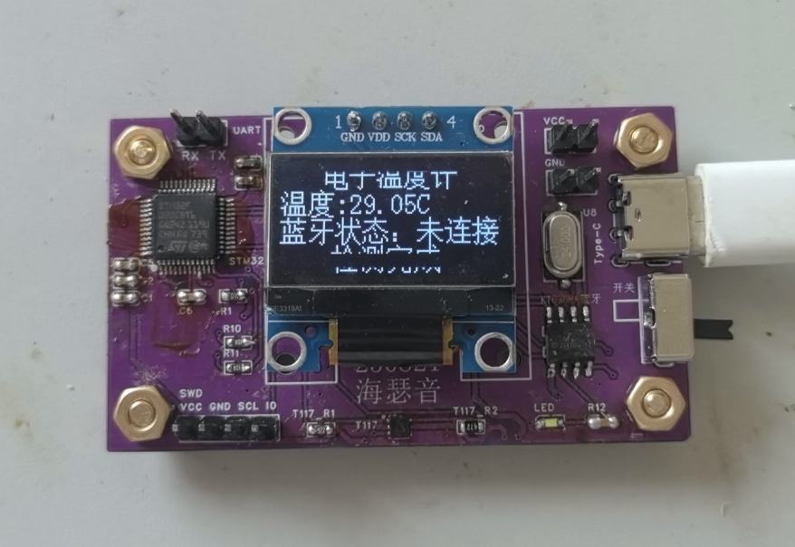

# STM32 智能蓝牙温度计

基于 STM32F103 + T117 温度传感器 + KT6368A 蓝牙模块的智能温度计，支持 OLED 实时显示和手机 APP 远程读取温度。

项目地址：https://github.com/zhiqiangme/STM32_Thermometer

嘉立创开源社区：https://oshwhub.com/mydeimos/works



## 硬件方案

| 模块 | 型号 | 接口 | 说明 |
|------|------|------|------|
| 主控 | STM32F103C8T6 | - | ARM Cortex-M3，72MHz |
| 温度传感器 | T117 | I2C（PB10-SCL, PB11-SDA） | 精度 ±0.1°C，32次平均滤波 |
| 显示屏 | 0.96" OLED（SSD1306） | I2C（PB6-SCL, PB7-SDA） | 128×64，中文显示 |
| 蓝牙模块 | KT6368A | UART（PA9-TX, PA10-RX） | SPP/BLE 双模，串口透传 |

## 项目结构

```
STM32_Thermometer/
├── STM32/          # STM32 固件（Keil MDK-ARM 工程）
│   ├── BSP/        # 板级驱动（T117、OLED、I2C）
│   ├── Drivers/    # HAL 库与 CMSIS
│   ├── System/     # 系统工具（延时、串口）
│   └── User/       # 主程序入口
├── Android/        # Android APP（Kotlin）
├── Harmony/        # HarmonyOS APP（ArkTS）
└── OSHWHub/        # 嘉立创开源平台项目描述
```

## STM32 固件

- 开发环境：Keil MDK-ARM 5
- 目录：`/STM32`
- 主要功能：
  - T117 温度采集（I2C 软件模拟，连续转换，32次平均滤波）
  - OLED 实时显示温度（500ms 刷新，区域清屏防残影）
  - 串口透传温度数据至 KT6368A 蓝牙模块（115200 波特率）

## Android APP

- 开发环境：Android Studio
- 目录：`/Android`
- 包名：`com.zhiqiangme.kt6368a`
- 最低 SDK：32（Android 12L）
- 主要功能：
  - BLE 扫描与连接
  - 接收蓝牙温度数据并显示
  - 通知栏常驻温度显示

## HarmonyOS APP

- 开发环境：DevEco Studio
- 目录：`/Harmony`
- 主要功能：
  - BLE 扫描与连接
  - 接收蓝牙温度数据并显示

## 开源许可

本项目硬件设计采用 [CERN-OHL-P-2.0](LICENSE) 开源，软件代码采用 [MIT License](LICENSE) 开源。
